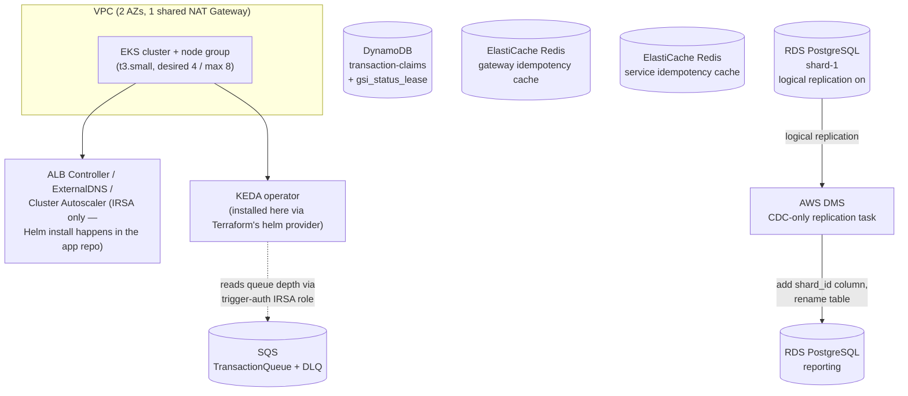

# microservice1_terraform

Terraform infrastructure for [`microservice_1`](../microservice_1) — a sharded, event-driven transaction-processing demo. This repo provisions everything that project's application code runs on: a VPC, an EKS cluster, sharded RDS PostgreSQL instances, DynamoDB, SQS, ElastiCache, KEDA, and an AWS DMS change-data-capture pipeline from the OLTP shards into a reporting database. It's deliberately kept separate from the application repository — the two communicate only through SSM Parameter Store / Secrets Manager, never through Terraform state or the Terraform CLI.

## Why a separate repo

A sibling project, `microservice_0` (which keeps its own Terraform in a `terraform/` subfolder rather than a separate repo), established the pattern this repo follows: application deploy pipelines (Helm, `kubectl`, CI) should never need Terraform state, credentials, or even the Terraform CLI installed. This repo's `ssm-outputs.tf` publishes every value the app-deploy pipeline needs — cluster name, ECR URLs, queue/table names, IAM role ARNs, DB endpoints and connection strings — to SSM Parameter Store and Secrets Manager under `/microservice1/<environment>/...`. The application repo's scripts read those via plain AWS CLI calls.

## What it provisions



- **Networking**: one VPC, two AZs, public + private subnets, a single NAT Gateway (in one AZ only — a real single point of failure and cost tradeoff, not redundant).
- **EKS**: cluster on the modern EKS access-entry API (not an `aws-auth` ConfigMap), a private-subnet managed node group, the EBS CSI driver as a real EKS-managed addon, and IRSA-only setup for the ALB Controller / ExternalDNS / Cluster Autoscaler (their Helm charts are installed by a separate pipeline in the app repo — the one exception is KEDA, installed directly here via Terraform's own `helm` provider).
- **Data layer**: RDS PostgreSQL (not Aurora — see below), DynamoDB, SQS, and two independent ElastiCache Redis clusters (one per service's idempotency cache).
- **CDC pipeline**: AWS DMS replicating the OLTP shard(s) into the reporting database, CDC-only (no full load).
- **IAM**: per-service IRSA roles scoped to exactly the AWS APIs each service calls, plus a separate account-wide GitHub OIDC role (in `github-actions-oidc/`) for CI.

## Why plain RDS, not Aurora

This AWS account's Free Tier plan blocks Aurora entirely — both the engine-type restriction and, after trying to work around it by switching engines, Aurora's "Express Configuration" creation mode, which is incompatible with a VPC-private cluster. The project went through two forced pivots (Aurora MySQL → Aurora PostgreSQL → plain RDS PostgreSQL) before landing here. `modules/rds-postgres-instance` is deliberately generic (used for every shard and the reporting instance) rather than Aurora-cluster-shaped.

### The RDS instance ceiling

The design calls for three independent shards plus one reporting instance. In practice, this account could only ever create **2 concurrent RDS instances** — discovered empirically (the account's published Service Quota for "DB instances" showed 40; the actual failures looked like an undocumented new-account/Free-Tier throttle). `main.tf` reflects this directly: `db_shard_0` and `db_shard_2` are commented out, and `db_shard_1` + `db_reporting` are the only two live instances — so the `mod 3` shard-routing logic in the application repo is correct and unchanged, but currently only exercises one physical shard database. `moved` blocks handle the rename from an earlier `aurora_*` module-address scheme without destroying and recreating the security groups/subnet groups that survived the Aurora→RDS switch.

### How CDC becomes possible

`enable_logical_replication = true` (set only on `db_shard_1`, not on the reporting instance) creates a dedicated parameter group setting `rds.logical_replication = 1` with `apply_method = "pending-reboot"` — RDS treats this as a static parameter and refuses to apply it without a reboot. This is the literal mechanism that makes DMS's CDC task possible.

### A local-dev workaround worth knowing about

`db_shard_1` and `db_reporting` are temporarily placed in **public subnets** (routed to the internet gateway) instead of private ones, gated behind a security group rule that only opens port 5432 to the developer's own current public IP (as a `/32`) plus the VPC CIDR — subnet placement alone doesn't grant reachability; the security group is the real gate. This exists solely so a developer running the .NET services outside the cluster can reach the databases directly for local debugging, and is meant to be reverted (`local_dev_ip_cidr = []`, falling back to private subnets) once that's no longer needed. ElastiCache has no equivalent option — `aws_elasticache_cluster` has no `publicly_accessible`-style argument at all, so those two Redis instances are VPC-only unconditionally.

## The CDC pipeline in detail

- **Replication instance**: `dms.t3.small` (the account no longer offers `dms.t3.micro`), single-AZ, private-subnet only, egress-only security group (5432 to the VPC, 443 for AWS API calls).
- **Endpoints**: one shared target endpoint pointed at the reporting instance; one source endpoint per live shard. Both force `ssl_mode = "require"` — RDS's own `rds.force_ssl = 1` rejects DMS's default of no SSL outright during endpoint connection testing.
- **Task type**: `migration_type = "cdc"` — change-data-capture only, deliberately no initial full load.
- **Table mapping**: a selection rule includes only `public.transactions`; transformation rules stamp a literal `shard_id` value onto every replicated row (DMS's `add-column` transformation, not derived from any source column) and rename the table to `transactions_reporting` on write.
- **Status: unvalidated.** Both the DMS module and `scripts/bootstrap-dms-roles.sh` (which creates the two account-wide IAM roles — `dms-vpc-role`, `dms-cloudwatch-logs-role` — that AWS DMS requires by fixed name) explicitly flag themselves in comments as written but not yet exercised against a real running replication task. Treat the whole CDC path, and the application repo's `SearchByDateRange` feature it feeds, as the newest and least-proven part of the system.

## KEDA and the identity-mismatch fix

KEDA is installed here (not in the app repo) via Terraform's `helm` provider — chart `keda` from `https://kedacore.github.io/charts`, pinned to `2.16.1`. The one Helm value set is `serviceAccount.operator.annotations["eks.amazonaws.com/role-arn"]`, pointed at a dedicated IRSA role (`irsa_keda_trigger_auth`, scoped to `sqs:GetQueueAttributes` only) — this annotates the **KEDA operator's own ServiceAccount**, not a dedicated ServiceAccount in the app namespace. That's a deliberate, tested choice: the more standard-looking alternative (`identityOwner=workload`, using `transaction-worker`'s own already-correct IRSA role directly) was tried first and confirmed, live, to not work for scale-from-zero SQS polling even with a target pod already running. This module encodes the fix, not the original design.

## Networking and IAM notes worth knowing before reusing this elsewhere

- **The EKS cluster security group allows inbound TCP 30000–32767 from `0.0.0.0/0`** — the entire Kubernetes NodePort range, open to the internet, so a NodePort-typed Service is reachable without an Ingress/ALB in front of it. This is a real, broad opening (any NodePort service on any node becomes internet-reachable) and isn't caveated in code as temporary — worth tightening before treating this as a production pattern.
- **The node group's IAM role is deliberately over-provisioned as a fallback**: on top of the dedicated IRSA roles for the ALB Controller, ExternalDNS, and Cluster Autoscaler, the node role itself also gets inline ASG-access, Route53, and ALB-Ingress policy documents attached directly (mirroring `eksctl`'s `--asg-access`/`--external-dns-access`/`--alb-ingress-access` node-group flags), plus the broad `AmazonEC2ContainerRegistryPowerUser` policy stacked on top of the read-only ECR pull policy already attached. Every node can theoretically do what the controllers do via its own instance profile, not only via pod-level IRSA — redundant by design, but broader than a minimal setup would grant.
- **ElastiCache has no encryption configured** — both Redis clusters use the classic `aws_elasticache_cluster` resource (single node, no replication group), which has no at-rest or in-transit encryption block available in this configuration. This is a real gap versus using `aws_elasticache_replication_group`, not a documented deliberate opt-out.
- **SQS's visibility timeout is deliberately unimportant**: 30 seconds, because the DynamoDB claim/lease table in the application repo — not SQS redelivery — is the actual crash-recovery mechanism. A dead-letter queue exists (`max_receive_count = 5`, 14-day retention, "longer than the main queue since these need a human to look at them").
- **DynamoDB** is on-demand billing (no idle per-hour charge), hash-keyed on `transaction_no`, with a `gsi_status_lease` GSI (`status` + `lease_expiry`) that exists specifically to support the application's "find every stranded claim" scan.

## `github-actions-oidc/`

A separate, singleton Terraform state inside this same repo (applied once via `just apply-github-oidc`, independent of any environment). Two things worth knowing:

- **It deliberately does not create its own GitHub OIDC provider.** GitHub's OIDC provider is a true account-wide singleton — one per unique issuer URL per AWS account — and `microservice_0/terraform/github-actions-oidc/`'s state already created it. This repo references the existing provider by its deterministic ARN instead of trying to manage it a second time (a second `aws_iam_openid_connect_provider` for the same URL fails with `EntityAlreadyExists`), with an explicit comment that two Terraform states owning one account-wide resource risks a `destroy` in either one breaking the other.
- **The trust policy already uses the fixed pattern**: `StringLike` against `token.actions.githubusercontent.com:sub`, matching `repo:<owner>@<owner_id>/<repo>@<repo_id>:*` with immutable numeric owner/repo IDs, not a name-based `StringEquals` (a sibling project hit exactly that bug — a name-based condition silently denies every `AssumeRoleWithWebIdentity` call). Even so, this repo independently hit a related incident: `github_repo_id` was left at a placeholder `"0"` past initial writing, and the resulting auth failures were first misdiagnosed as a missing `AWS_GITHUB_ACTIONS_ROLE_ARN` GitHub secret (which was also, separately, actually missing). Once both were found, the correct numeric ID was looked up via `gh api repos/<owner>/<repo> --jq '.id'` and **the live IAM role's trust policy was patched directly via `aws iam update-assume-role-policy`**, ahead of the next `terraform apply` — meaning the live AWS state and this file are in sync now only because of that manual out-of-band patch having been applied, not because Terraform re-applied afterward.

## Repository layout

```
microservice_1_terraform/
├── main.tf, variables.tf, outputs.tf     per-environment root module
├── ssm-outputs.tf                        cross-pipeline handoff to SSM/Secrets Manager
├── backend.tf                            S3 backend (bucket/key/region filled in per environment)
├── environments/
│   ├── develop/          real values + a local secrets.tfvars (gitignored)
│   ├── staging/          .example files only
│   └── production/       .example files only
├── github-actions-oidc/   separate singleton state — CI's IAM role
├── modules/
│   ├── vpc, eks-cluster, eks-nodegroup, eks-ebs-csi,
│   │   eks-alb-controller, eks-external-dns, eks-cluster-autoscaler
│   ├── rds-postgres-instance      applied per shard + once for reporting
│   ├── dms, dms-source-endpoint-task
│   ├── dynamodb, sqs, elasticache, ecr
│   ├── keda                       the one Helm-installed chart in this repo
│   └── irsa-service-role          generic reusable IRSA trust-policy + role module
└── scripts/
    ├── bootstrap-backend.sh        creates the shared S3 state bucket (idempotent)
    └── bootstrap-dms-roles.sh      creates DMS's two required account-wide IAM roles (unvalidated)
```

## Usage

```bash
just bootstrap-backend        # one-time: create the shared S3 state bucket
just apply-github-oidc        # one-time, account-wide: CI's IAM role

just plan develop             # or staging / production
just apply develop
just destroy develop          # run `just destroy-app <env>` in the app repo's Helm dir FIRST —
                               # the ALB Controller's own ALB isn't a Terraform resource, and its
                               # security groups/ENIs can block VPC deletion if left behind
```

State locking uses Terraform's native S3 `use_lockfile` (Terraform ≥ 1.10) — no DynamoDB lock table. All three environments share one S3 bucket (`steven-zhang-learning`) with separate state keys, so they never share state despite living in the same bucket — the same convention `microservice_0/terraform` uses.

## Design notes

- **Only one of three designed shards is currently a real, distinct database.** `db_shard_0`/`db_shard_2` are commented out to fit this account's proven 2-instance RDS ceiling; the application's sharding logic is unaffected and will start exercising real shards again once more instances are available.
- **The CDC/DMS pipeline is unvalidated.** Both the Terraform module and the bootstrap script that provisions DMS's required IAM roles say so directly in their own comments — this was the most recent work on the project and hasn't been proven against a live replication task yet.
- **The EKS cluster's open NodePort range and the node role's broad, redundant IAM grants** are real hardening opportunities, not deliberate risk acceptance — worth tightening before using this as a template beyond a personal demo account.
- **KEDA's operator-identity annotation** is a documented, tested fix for a real scale-from-zero bug, not the originally-intended design — useful context if this ScaledObject/IRSA pattern is copied elsewhere.
- **The GitHub OIDC role's trust policy is currently correct only because of a manual, out-of-band `aws iam update-assume-role-policy` patch**, not because the checked-in Terraform was re-applied after the `github_repo_id` fix — worth reconciling (a `terraform apply` here should be a no-op if the file and live state now genuinely match, but that hasn't been confirmed).

## Related

- `microservice_1` — the application repository this infrastructure supports.
- `microservice_0` — a sibling portfolio project establishing the same conventions this repo follows (SSM-based handoff to the app pipeline, one shared GitHub OIDC provider, one shared S3 state bucket with per-project key prefixes). Its Terraform lives inside that repo, at `microservice_0/terraform/`, rather than as a separate repository.
